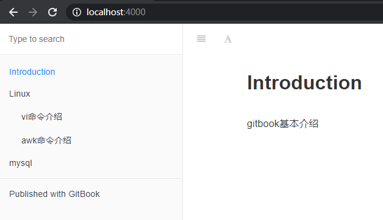
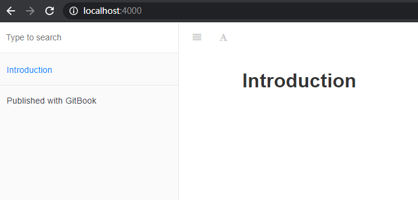

# 用markdown写一本自己的书

>[gitbook官网](https://www.gitbook.com/)   
>[gitbook文档](https://docs.gitbook.com/)


## 环境依赖

下载安装[node.js](https://nodejs.org/en/)

```
$ node -v
v12.16.3
```

## 安装gitbook

```
$ npm install gitbook-cli -g
```

## 使用方法

1.先创建一个目录，终端进入该目录，运行`gitbook init`
```
$ gitbook init
warn: no summary file in this book
info: create README.md
info: create SUMMARY.md
info: initialization is finished
```
运行后，会生成两个md文件，README.md说明文件，SUMMARY.md是目录文件

2.运行`gitbook serve [--port 8080]`启动服务，默认端口4000
```
$ gitbook serve
Live reload server started on port: 35729
Press CTRL+C to quit ...

info: 7 plugins are installed
info: loading plugin "livereload"... OK
info: loading plugin "highlight"... OK
info: loading plugin "search"... OK
info: loading plugin "lunr"... OK
info: loading plugin "sharing"... OK
info: loading plugin "fontsettings"... OK
info: loading plugin "theme-default"... OK
info: found 1 pages
info: found 0 asset files
info: >> generation finished with success in 1.7s !

Starting server ...
Serving book on http://localhost:4000
```

3.访问`http://localhost:4000`


4.也可以使用`gitbook build`生成_book目录离线版

如果想给书加个账号登录，可以采用nginx登录限制，访问离线版的方式来实现。

使用htpasswd生成用户密码信息
```
htpasswd -c ./gitbook_auth_conf admin
```
如果没有该命令，可以使用`yum install -y httpd-tools
`安装
nginx配置文件
```
server {
    listen 8080;
    location / {
        root /root/gitbook/_book;   #build后的_book目录路径
        index index.html;
        auth_basic "Please input password";
        auth_basic_user_file /etc/nginx/passwd/gitbook_auth_conf;    #上面生成用户密码文件
    }

    error_page 404 /404.html;
        location = /40x.html {
    }

    error_page 500 502 503 504 /50x.html;
        location = /50x.html {
    }
}
```
启动nginx后，访问`http://ip:8080`则需要输入账号密码了。

## book.js

文件中可配置一些[插件](https://plugins.gitbook.com/)，配置后需执行`gitbook install`安装，默认带有 5 个插件，highlight、search、sharing、font-settings、livereload。
```
{
    "title": "demo",         //标题
    "author": "author",      //作者
    "language": "zh-hans",   //语言环境
    "links": {
      "sidebar": {
        "GitHub": "https://xxx"    //可以添加github链接
      }
    },
    "plugins": [            //插件
      "-sharing",           //-可以删除默认带的插件
      "-livereload",
      "image-captions",
      "github",
      "editlink",
      "anchors",
      "donate",            #打赏插件
      "anchor-navigation-ex",
      "expandable-chapters-small"
    ],
    "pluginsConfig": {
      "image-captions": {
        "attributes": {
          "width": "600"
        },
        "caption": "图 _PAGE_LEVEL_._PAGE_IMAGE_NUMBER_ - _CAPTION_"
      },
      "github": {
        "url": "https://xxxx"
      },
      "editlink": {
        "base": "https://xxxx",
        "label": "编辑本页"
      },
      "anchor-navigation-ex": {
        "showLevel": false
      },
      "donate": {
        "alipay": "/source/images/weixin.png",
        "title": "",
        "button": "赞赏",
        "alipayText": " "
      }
    
    }
  }
```

## 目录结构
以开头截图目录结构为例   
```
./
  book.json
  README.md
  SUMMARY.md
  linux/
        vi.md
        awk.md
  mysql/
        init.md
```

`SUMMARY.md`对应的目录则为demo样子
```
# Summary

* [Introduction](README.md)

* Linux
  * [vi命令介绍](linux/vi.md)
  * [awk命令介绍](linux/awk.md)

* [mysql](mysql/init.md)
```

## gitbook.com
每个账号可以免费发布一本书，可绑定github账号，push后则会自动更新，感兴趣的小伙伴可以尝试一下。