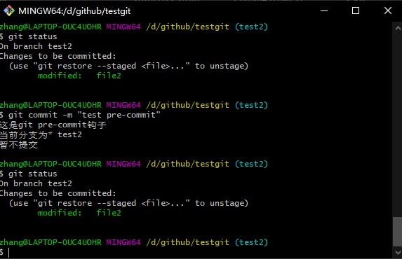
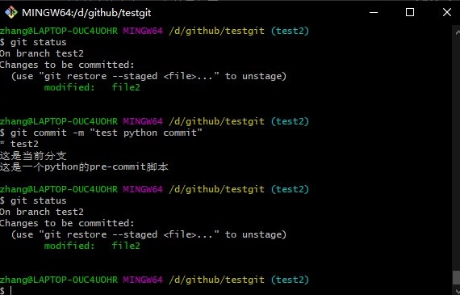
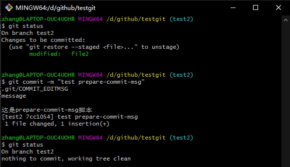
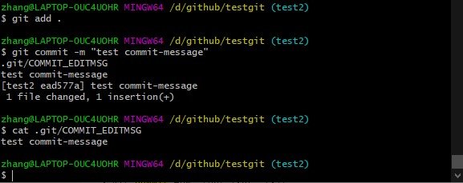
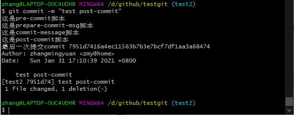
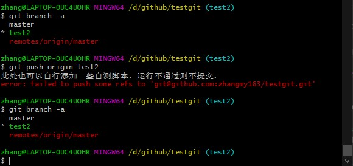

# 简介

git在发生特定重要动作时会触发自定义脚本。有两组这样的钩子：客户端的和服务端的。

客户端的钩子都存放在当前仓库的`.git/hooks`下，有一些示例shell脚本以.sample结尾,也可以使用其他自己熟悉的语言编写，比如python等。   
服务端的存放在服务器的仓库目录，类似于`repositories/用户/仓库名.git/custom_hooks`这种目录下

本文简单介绍一下客户端的钩子

# pre-commit 
钩子在键入提交信息前运行,把如下脚本放到.git/hooks目录下，赋予可执行权限。脚本以非零状态结束，则终止提交。
```bash
#!/bin/sh
echo "这是git pre-commit钩子"
echo "当前分支为$(git branch|grep \*)"
echo "暂不提交"
exit 1
```
在git commit时会触发该脚本，运行效果如图


python脚本，运行效果如图

```python
#! /bin.python
import os

def run():
  os.system("git branch|grep \*")
  print("这是当前分支")
  print("这是一个python的pre-commit脚本")
  exit(1)

run()
```



# prepare-commit-msg
对于一般提交没有什么作业，但是在自动产生默认提交信息时结合提交模板时非常实用。提交模板请自行查询git config commit.template

直接提交的效果
```bash
#!/bin/sh

COMMIT_MSG_FILE=$1
COMMIT_SOURCE=$2
SHA1=$3

echo "$COMMIT_MSG_FILE"
echo "$COMMIT_SOURCE"
echo "$SHA1"

echo "这是prepare-commit-msg脚本"
```


# commit-msg
此处接收一个参数，存有当前提交信息的临时文件的路径，文件里会存着提交信息

```
#!/bin/sh
echo $1
cat $1
```


# post-commit
整个提交过程完成后运行，不接收任何参数。
```bash
#!/bin/sh
echo "这是post-commit脚本"
echo "最后一次提交$(git log -1 HEAD)"
```


# pre-push
会在git push运行期间调用，失败时不会把代码push到远程。

```bash
#!/bin/sh

remote="$1"
url="$2"

z40=0000000000000000000000000000000000000000

while read local_ref local_sha remote_ref remote_sha
do
        if [ "$local_sha" = $z40 ]
        then
                # Handle delete
                :
        else
                if [ "$remote_sha" = $z40 ]
                then
                        # New branch, examine all commits
                        range="$local_sha"
                else
                        # Update to existing branch, examine new commits
                        range="$remote_sha..$local_sha"
                fi

                # Check for WIP commit
                commit=`git rev-list -n 1 --grep '^WIP' "$range"`
                if [ -n "$commit" ]
                then
                        echo >&2 "Found WIP commit in $local_ref, not pushing"
                        exit 1
                fi
        fi
done

echo "此处也可以自行添加一些自测脚本，运行不通过则不提交."
echo "暂不提交"
exit 1
```


# 其他钩子
还有一些不太常用的钩子，就不一一介绍了。   
`pre-rebase`变基之前会调用。   
`pre-rewrite`更好提交记录时会调用。  
`post-checkout`checkout成功后会调用。   
`post-merge`git merge成功后会调用   

以上就是客户端的一些钩子的介绍，感兴趣的同学可以在自己的仓库尝试一下。发挥一下想象力，用这些钩子可以为我们自动做哪些事情。


# 参考
> https://www.git-scm.com/book/zh/v2/%E8%87%AA%E5%AE%9A%E4%B9%89-Git-Git-%E9%92%A9%E5%AD%90