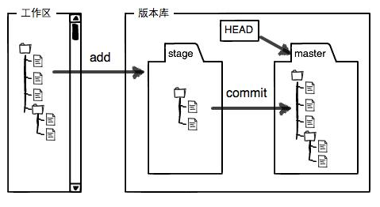

# git




## 创建版本库

两种方式

### 一、初始化

`git init` 当前文件夹创建版本库

`git remote add origin <url>`当前目录添加到远程仓库

`git push -u origin master`提交到远程仓库

### 二、从远程仓库克隆

`git clone <url>` clone远程仓库到本地

## 常用操作

`git status` 查看状态

`git add <filename>或.` 把文件提交到暂存区

`git rm <filename>` 删除文件提交到暂存区

`git commit -m "message"` 把暂存区文件提交到当前分支

`git log` 查看提交日志
```
git log --pretty=oneline
git log --graph --pretty=oneline --abbrev-commit
```

`git diff HEAD -- <filename>` 查看工作区和版本库里面最新版本的区别

## 撤销修改

`git checkout -- <filename>` 丢弃工作区的修改，还原到与远程库一致（该文件在远程库存在时）

`git reset HEAD <filename>` 可以把暂存区的修改撤销掉，即撤销add操作

`git reset --soft HEAD^` 可以撤销最近一次的commit到暂存区

`git reset HEAD^` 可以撤销最近一次的commit到工作区

`git reset --hard HEAD^` 可以撤销最近一次的commit到工作区，并丢掉所有修改

回滚
```
git reset --hard <hash>
git push origin master -f
```

## 分支基础操作

`git branch` 查看分支

`git branch <name>` 创建分支

`git checkout <name>`或者`git switch <name>` 切换分支

`git checkout -b <name>`或者`git switch -c <name>` 创建+切换分支

`git merge <name>` 合并某分支到当前分支

`git branch -d <name>` 删除本地分支(如果分支没有被合并过，会有提示，需要使用-D强制删除)

`git push origin <name>` 推送到远程仓库

删除远程仓库分支
```
git branch -r -d origin/<name>
git push origin :<name>
```

## 解决冲突

当合并分支与当前都更改了相同文件时会出现冲突，当前分支名称会展示`(<name>|MERGING)`字样
Git用`<<<<<<<，=======，>>>>>>>`标记出不同分支的内容

修改冲突文件后，add、commit则解决冲突

`git merge --abort`可回退到merge之前的状态

## 分支管理策略

合并分支时，加上--no-ff参数就可以用普通模式合并，合并后的历史有分支，能看出来曾经做过合并，而fast forward合并就看不出来曾经做过合并。

`git merge --no-ff -m "merge with no-ff" <name>`

## stash技巧

当手头工作没有完成时，先把工作现场`git stash`一下，然后去修复bug，修复后，再`git stash pop`，回到工作现场

`git stash` 将当前分支的修改创建stash，之后当前分支状态干净，切换其他分支可以去完成其他工作

`git stash list` 列出stash

`git stash apply` 恢复，但是恢复后，stash内容并不删除

`git stash drop` 用来删除

`git stash pop` 恢复的同时把stash内容也删了

`git stash apply stash@{0}` 恢复指定现场

## 多人协作可能遇到的问题

git push时失败，提示
```git
error: failed to push some refs to 'git@xxxxxx/xxx.git'
hint: Updates were rejected because the tip of your current branch is behind
hint: its remote counterpart. Integrate the remote changes (e.g.
hint: 'git pull ...') before pushing again.
hint: See the 'Note about fast-forwards' in 'git push --help' for details.
```

推送失败，因为你的小伙伴的最新提交和你试图推送的提交有冲突，解决办法也很简单，Git已经提示我们，先用git pull把最新的提交从origin/dev抓下来，然后，在本地合并，解决冲突，再推送：

```
$ git pull
There is no tracking information for the current branch.
Please specify which branch you want to merge with.
See git-pull(1) for details.

    git pull <remote> <branch>

If you wish to set tracking information for this branch you can do so with:

    git branch --set-upstream-to=origin/<branch> dev
```

git pull也失败了，原因是没有指定本地dev分支与远程origin/dev分支的链接，根据提示，设置dev和origin/dev的链接：

```
$ git branch --set-upstream-to=origin/dev dev
再
$ git pull
```

因此，多人协作的工作模式通常是这样：

首先，可以试图用`git push origin <branch-name>`推送自己的修改；

如果推送失败，则因为远程分支比你的本地更新，需要先用`git pull`试图合并；

如果合并有冲突，则解决冲突，并在本地提交；

没有冲突或者解决掉冲突后，再用`git push origin <branch-name>`推送就能成功！

如果`git pull`提示`no tracking information`，则说明本地分支和远程分支的链接关系没有创建，用命令`git branch --set-upstream-to <branch-name> origin/<branch-name>`。

这就是多人协作的工作模式，一旦熟悉了，就非常简单。

## 标签管理

`git tag <tagname>`用于新建一个标签，默认为HEAD，也可以指定一个commit id；

`git tag -a <tagname> -m "blablabla..."`可以指定标签信息；

`git tag`可以查看所有标签。

`git push origin <tagname>`可以推送一个本地标签；

`git push origin --tags`可以推送全部未推送过的本地标签；

`git tag -d <tagname>`可以删除一个本地标签；

`git push origin :refs/tags/<tagname>`可以删除一个远程标签。

## .gitignore

不需要从头写.gitignore文件，GitHub已经为我们准备了各种配置文件，只需要组合一下就可以使用了。所有配置文件可以直接在线浏览：https://github.com/github/gitignore

忽略文件的原则是：

1. 忽略操作系统自动生成的文件，比如缩略图等；
2. 忽略编译生成的中间文件、可执行文件等，也就是如果一个文件是通过另一个文件自动生成的，那自动生成的文件就没必要放进版本库，比如Java编译产生的.class文件；
3. 忽略你自己的带有敏感信息的配置文件，比如存放口令的配置文件。

如果你确实想添加的文件被.gitignore忽略了，可以用-f强制添加到Git：

```
git add -f <file>
```

可能是.gitignore写得有问题，需要找出来到底哪个规则写错了，可以用`git check-ignore`命令检查：

```
git check-ignore -v <file>
```

## 配置别名

```
$ git config --global alias.st status
$ git config --global alias.co checkout
$ git config --global alias.ci commit
$ git config --global alias.br branch
$ git config --global alias.unstage 'reset HEAD'
```

`git config --global alias.lg "log --color --graph --pretty=format:'%Cred%h%Creset -%C(yellow)%d%Creset %s %Cgreen(%cr) %C(bold blue)<%an>%Creset' --abbrev-commit"`

## pull和fetch的区别


`git fetch`:是将远程主机的最新内容拉到本地，用户在检查了以后决定是否合并到工作本机分支中。
```
git  fetch origin master:temp 
\\本地新建一个temp分支，并将远程origin仓库的master分支代码下载到本地temp分支
git diff temp
\\比较远程代码与本地代码的区别
git merge temp
\\将temp分支合并到本地master分支
git branch -d temp
\\如果不想保留分支，可以将其删除
```
`git pull`:基于本地的FETCH_HEAD记录，比对本地的FETCH_HEAD与远程仓库的版本号，然后git fetch获得当前的远程分支的后续版本的数据，然后利用git merge将其与本地的分支合并，可以认为是git pull是git fetch和git merge两个步骤的合并。   
实际的git pull 过程可以理解为
```
git fetch origin master  \\将远端的master分支拉取最新内容
git merge FETCH_HEAD \\将拉取的最新内容与当前分支合并
```

`git pull`用法：
```
git pull <远程主机名>  <远程分支名>:<本地分支名>
\\将远程主机的某个分支，与本地的指定分支合并
```

>https://www.liaoxuefeng.com/wiki/896043488029600/896067008724000   
>https://www.jianshu.com/p/64ef955e9c44