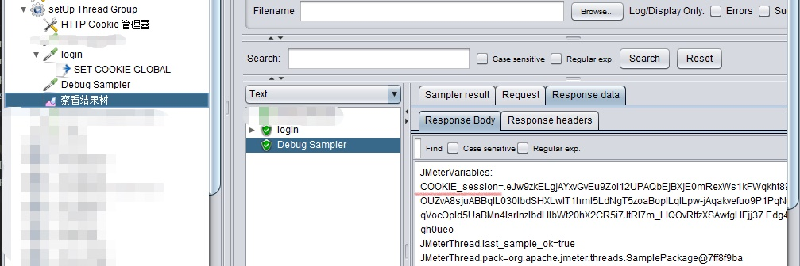
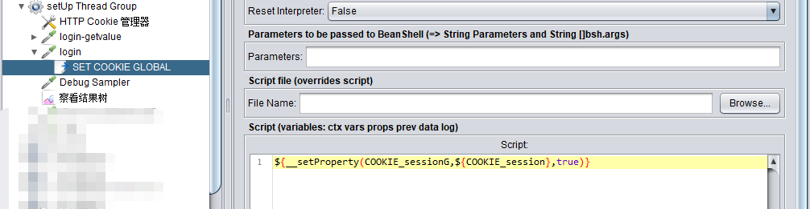
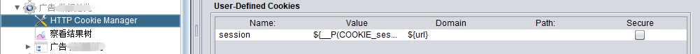

修改jmeter.properties文件中`CookieManager.save.cookies=true`

配置setUp Thread Group添加cookie管理器，然后在Http请求添加BeanShell PostProcessor

可以添加Debug Sampler来找到要与其他线程组共享的cookie的值

从图中可以看到要用到的cookie名称为COOKIE_session

在BeanShell PostProcessor中设置`${__setProperty(COOKIE_sessionG,${COOKIE_session},true)}`

其他线程组调用时，在cookie管理器中配置value为`${__P(COOKIE_sessionG,)}`

