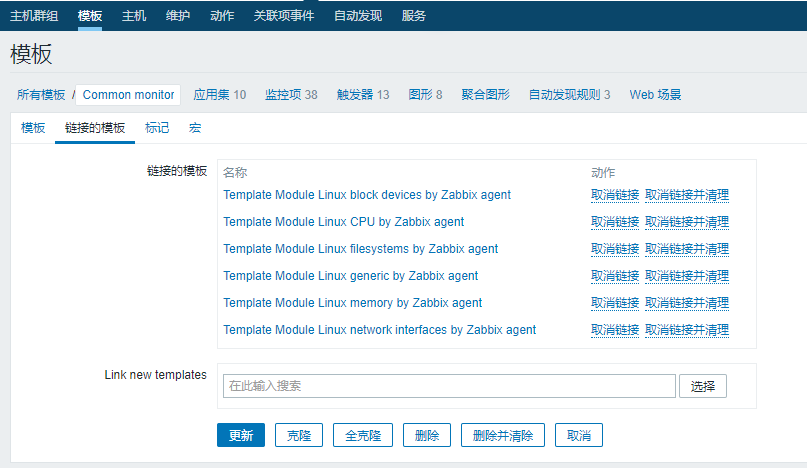
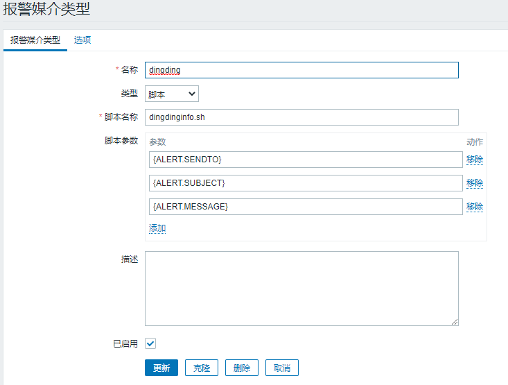

# 安装

>参考https://www.cnblogs.com/yaun1498078591/p/10782229.html

## server

使用docker方式安装

1.先安装数据库mysql
```
docker run --name zabbix-mysql-server --hostname zabbix-mysql-server \
-e MYSQL_ROOT_PASSWORD="123456" \
-e MYSQL_USER="zabbix" \
-e MYSQL_PASSWORD="123456" \
-e MYSQL_DATABASE="zabbix" \
-p 33061:3306 \
-d mysql:5.7 \
--character-set-server=utf8 --collation-server=utf8_bin 
```

2.创建zabbix-server
```
docker run  --name zabbix-server-mysql --hostname zabbix-server-mysql \
--link zabbix-mysql-server:mysql \
-e DB_SERVER_HOST="mysql" \
-e MYSQL_USER="zabbix" \
-e MYSQL_DATABASE="zabbix" \
-e MYSQL_PASSWORD="123456" \
-v /etc/localtime:/etc/localtime:ro \
-v /data/docker/zabbix/alertscripts:/usr/lib/zabbix/alertscripts \
-v /data/docker/zabbix/externalscripts:/usr/lib/zabbix/externalscripts \
-p 10051:10051 \
-d \
zabbix/zabbix-server-mysql 
```

3.安装web-nginx
```
docker run --name zabbix-web-nginx-mysql --hostname zabbix-web-nginx-mysql \
--link zabbix-mysql-server:mysql \
--link zabbix-server-mysql:zabbix-server \
-e DB_SERVER_HOST="mysql" \
-e MYSQL_USER="zabbix" \
-e MYSQL_PASSWORD="123456" \
-e MYSQL_DATABASE="zabbix" \
-e ZBX_SERVER_HOST="zabbix-server" \
-e PHP_TZ="Asia/Shanghai" \
-p 7000:80 \
-p 8443:443 \
-d \
zabbix/zabbix-web-nginx-mysql
```

http:xx.xx.xx.xx:7000
账号密码Admin/zabbix

## agent

```
#rhel6
sudo rpm -ivh https://mirrors.tuna.tsinghua.edu.cn/zabbix/zabbix/4.4/rhel/6/x86_64/zabbix-agent-4.4.4-1.el6.x86_64.rpm

#rhel7
#rpm -ivh https://repo.zabbix.com/zabbix/4.0/rhel/7/x86_64/zabbix-release-4.0-1.el7.noarch.rpm
#yum -y install zabbix-agent-4.0.1

sudo vi /etc/zabbix/zabbix_agentd.conf     #修改Server IP 和ServerActive

sudo service zabbix-agent start

sudo netstat -anp|grep 10050

```

# 使用手册

>https://www.zabbix.com/documentation/3.4/zh/manual/quickstart

配置步骤：  
1.新建主机  
2.新建监控项  
3.新建触发器  
4.获取问题通知，需要配置用户里的邮箱  
5.配置动作连接到触发器  
6.新建模板，可以包括监控项、触发器、图像等，在新建主机时选择模板，可以带过去对应的项  

基础监控模板

满足基本监控要求，CPU、内存、网络等



监控机器是否down机，可以在Zabbix Server配置**简单检测**`icmpping["xx.xx.xx.xx"]`

监控服务可使用`proc.num`检测服务的进程数量

监控服务占用内存使用`proc.mem[,,,进程名,rss]`

配置钉钉告警
```
#给容器安装curl命令
docker exec -it -u root  zabbix-server-mysql apk add  curl

#钉钉脚本放在
/data/docker/zabbix/alertscripts/dingdinginfo.sh

#dingdinginfo.sh
#! /bin/bash
function dingding() {
	sendto=$1
	message=${@:2}
	url='https://oapi.dingtalk.com/robot/send?access_token=3b3596341ea7330922a765ffe2225c481b5330d632da5e2ac28ec514d19e762b'

	JSON='{ "msgtype": "text", "text": { "content":"'"监控：$message"'" } }'
	echo "$content"
	echo $JSON
	curl -s -H 'Content-Type: application/json;charset=utf-8' -d "$JSON" $url
}
dingding $@
#################

#给脚本加执行权限
sudo chmod +x /data/docker/zabbix/alertscripts/dingdinginfo.sh
```

