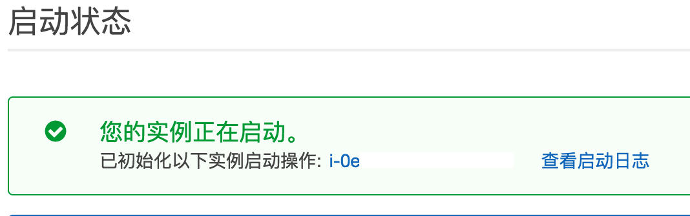

注意，这篇帖子具有时效性，至少目前（2017.07.06）是无坑的，也许当你读到这篇文章的时候帖子中的某些内容已经和现实有一些差别了

## 第一步、在亚马逊云服务（AWS）开虚机（EC2）

1.在[**AWS国际服**](https://aws.amazon.com)注册账号，绑定信用卡，通过短信验证，等几小时后账号彻底被激活就可以使用了，这个过程会扣你1美元验证信用卡是通的，后面会退给你。需要注意的是，AWS的国际服和国服是隔离的，如果你在海外需要翻回墙内，那么你应该在[**AWS国服**](https://www.amazonaws.cn)开机子

2.从屏幕右上角选择一个节点位置（如东京），进EC2（虚机）服务，选择启动实例，开一台符合免费条件的Ubuntu机器，一直点下一步到底


3.在最后一步选择创建新的密钥对，输入密钥对名称，点下载会拿到一个.pem，然后点启动实例，等待几分钟后虚机开启





4.注意这台电脑的公网IP并不是固定的，如果关掉这台机子重新开（不是重启），那么这个IP就会改变，我们可以使用AWS的“弹性IP”来把这个地址固定下来，当然，这一步不是必须的
点左边的弹性IP，点分配新地址，会拿到一个IP，然后关联刚刚开启的虚机即可


5.修改安全组，每个EC2虚机器都对应一个安全组，安全组里控制了访问权限，所以进入左边的安全组选项（也可以通过机子实例右边的安全组链接进入），编辑入站规则，很粗暴地开启所有权限


6.下一步要SSH到这台虚机上，windows系统请自行查操作方法，mac电脑将刚才的.pem复制到~/.ssh下并给400权限

```shell
mv ~/Downloads/xxx.pem ~/.ssh/
chmod 400 ~/.ssh/xxx.pem
```

使用ssh命令登陆这台机子

```shell
ssh -i ~/.ssh/xxx.pem ubuntu@机子的IP或Public DNS
```


## 第二步、安装新内核

毕竟自己老看油管上游戏的生放送，于是这一步纯粹是为了使用TCP-BBR提升网速，保证视频不卡，没有兴趣可以选择跳过

先ls出系统中存在的内核

```shell
$ dpkg -l | grep linux-image | awk '{print $2}'
linux-image-4.4.0-1013-aws
linux-image-aws
```

这里没有我们要的内核，于是从[**官网**](http://kernel.ubuntu.com/)下载新内核

```shell
$ wget –O linux–image–4.9.0–amd64.deb http://kernel.ubuntu.com/~kernel-ppa/mainline/v4.9/linux-image-4.9.0-040900-generic_4.9.0-040900.201612111631_amd64.deb
```

如果因为莫名其妙的原因下载不了，那么就用本机下载scp过去也可以

```shell
$ scp -i ~/.ssh/lyp_0428.pem ~/Download/linux-image-4.9.0-040900-generic_4.9.0-040900.201612111631_amd64.deb ubuntu@52.79.211.166:/home/ubuntu/
```

安装内核

```shell
$ sudo dpkg -i linux-image-4.9.0-040900-generic_4.9.0-040900.201612111631_amd64.deb
```

再ls就能看到安装成功后的

```shell
linux-image-4.4.0-1013-aws
linux-image-4.9.0-040900-generic
linux-image-aws
```

然后删除其他内核，过程中输入Y，最后保证ls出来只剩下刚刚下载的内核

```shell
$ sudo apt-get purge [其他内核名]
```

更新引导系统文件并重启

```shell
$ sudo update–grub
$ sudo reboot
```

然后重新ssh上去，为了开启BBR需要修改/etc/sysctl.conf，于是先加权限

```shell
$ sudo chmod a+w /etc/sysctl.conf
```

然后开启BBR

```shell
$ echo “net.core.default_qdisc=fq” >> /etc/sysctl.conf
$ echo “net.ipv4.tcp_congestion_control=bbr” >> /etc/sysctl.conf
$ sudo sysctl -p
```

查看生效

```shell
$ sysctl net.ipv4.tcp_available_congestion_control
net.ipv4.tcp_available_congestion_control = bbr cubic reno
$ lsmod | grep bbr
tcp_bbr                20480  0
```

## 第三步、安装和配置SS服务端

注意，这篇文章是unbuntu的，如果你用的是centOS，那么如果遇到报错的话，需要把一些目录chown成ec2-user。

这里使用[**SS**](https://github.com/shadowsocks/shadowsocks/tree/master)配置翻墙

先装pip

```shell
$ sudo apt-get update
$ sudo apt-get install python-pip
```

为了防止报错踩坑，首先

```shell
$ export LC_ALL=C
```

然后就可以正常安装SS了

```shell
$ pip install shadowsocks
Collecting shadowsocks
  Downloading shadowsocks-2.8.2.tar.gz
Building wheels for collected packages: shadowsocks
  Running setup.py bdist_wheel for shadowsocks ... done
  Stored in directory: /home/ubuntu/.cache/pip/wheels/c9/d8/ff/5425932823af361970658e9421b4d53ac50b08dcbe6fd41e5f
Successfully built shadowsocks
Installing collected packages: shadowsocks
Successfully installed shadowsocks
```

之后添加配置

```shell
$ sudo vim /etc/shadowsocks.json
```

进去按i切换到输入模式，输入

```json
{
    "server":"0.0.0.0",
    "server_port":"随意端口比如9527",
    "local_address":"127.0.0.1",
    "local_port":"1080",
    "password":"你的密码",
    "timeout":1000,
    "method":"aes-256-cfb",
    "fast_open":false
}
```

之后按冒号:，输入wq回车即保存完毕。

最后把SS服务端起在后台，注意有些文章让你用-d，但是如果不在root用户下安装和启动ss会报错，所以

```shell
$ nohup ssserver -c /etc/shadowsocks.json start &
```

配置完毕，可以关掉SSH窗口了

## 四、安装客户端

到[**这里**](https://www.shadowsocks.com.hk/client.html)下载对应平台平台的客户端，添加配置（IP、端口、密码）即可翻墙上网！


