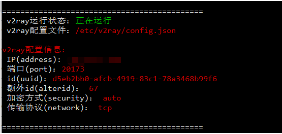
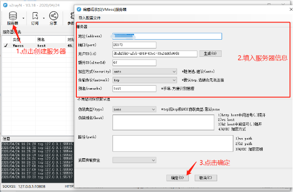
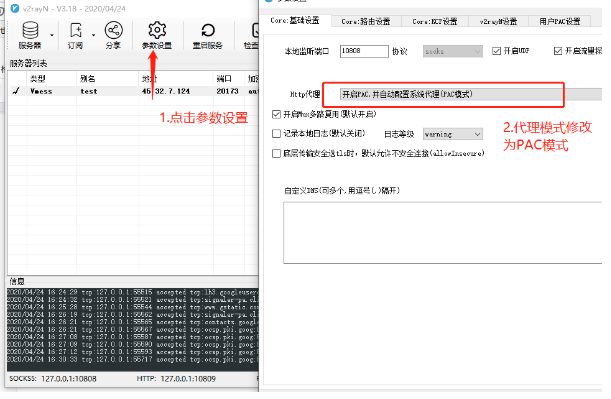
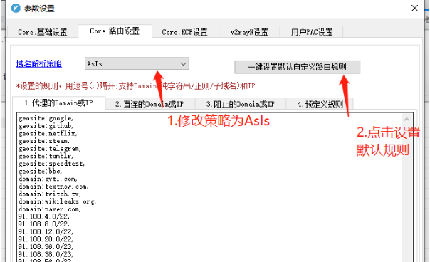
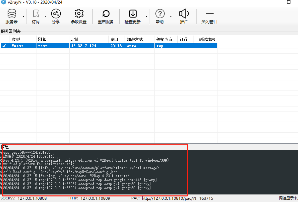

>https://www.hijk.pw/centos-one-click-install-v2ray/ 

在海外服务器运行一键脚本
```
bash <(curl -sL https://raw.githubusercontent.com/hijkpw/scripts/master/centos_install_v2ray.sh)
```
当出现输入端口号时，可配置想要的端口号，这里注意端口号不能为22。直到窗口出现，表示脚本安装配置完成。



配置客户端
>windows:https://netfiles.pw/download.php?filename=/v2/windows/v2rayN-v3.18.zip   
>mac:https://netfiles.pw/download.php?filename=/v2/macos/v2rayU-v2.0.0.dmg 

windows配置：

1.下载后将压缩包解压至非C盘以外的地方，进入V2rayN-Core目录，点击V2RayN.exe
windows下载之后，杀毒软件可能会提示告警，手动将其解除告警

2.点击桌面右下角小图标，进入程序页面


3.点击菜单栏参数设置，修改代理模式 


4.点击路由设置

这个地方点击之后系统防火墙可能会弹出提示，点击允许访问即可。

5.此时主界面信息处会展示start信息，就可以试一下Google等网站是否可使用了


MAC安装教程配置教程见：https://www.hijk.pw/v2rayu-config-tutorial/ 